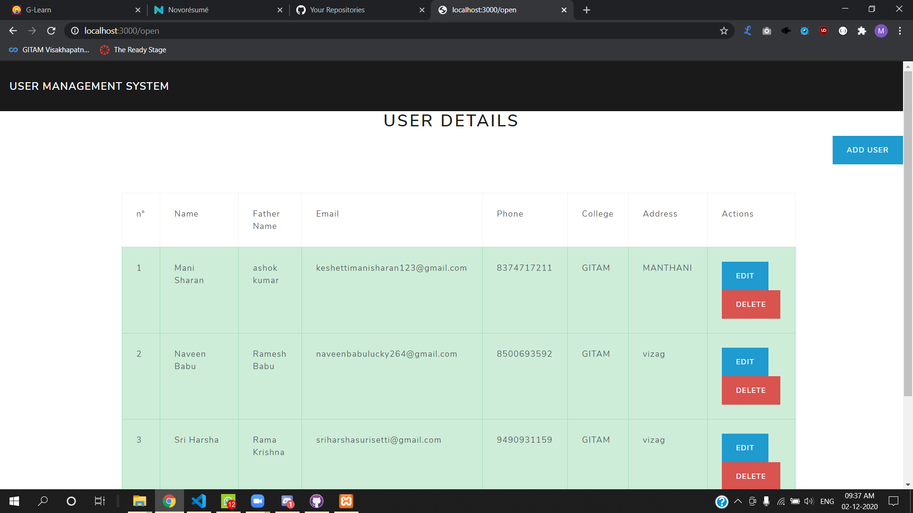
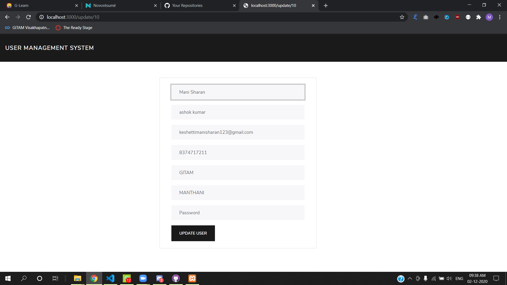

# Major-Project
The users management report lists user IDs, user roles and user ID status for all users within your PPSR(Personal Property Security Registration System) account. This report assists in managing users within your account. The user management report allows you to identify all  users of  account and, if necessary, remove users that no longer require access. You can also modify user access due to a change in details. On this project we will develop a User Management System.

